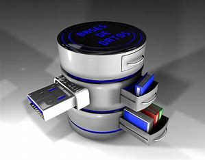

# Base de datos para aplicaciones

---

Este repositorio contiene informacion de base de datos refernt a los siguienrtes temas:

1. Consultas con Joins(inner join, left join,right join y full join)
1. views
1. Storage Procedures
1. Triggers
1. Manejo de Transacciones 
1. Seguridad
1. Despliegue de Aplicaciones

[DEFINICION DE BASE DE DATOS](https://aws.amazon.com/es/what-is/database/)